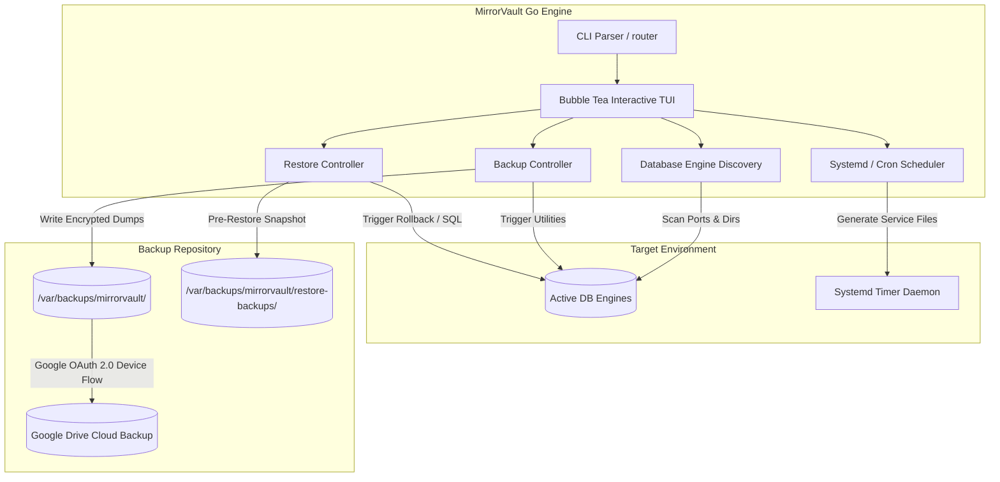
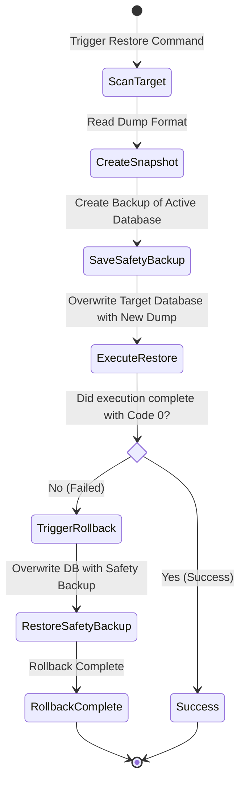

# 🗄️ MirrorVault: Secure Go Database Backup & Recovery Agent

An enterprise-grade, zero-dependency database discovery, backup, restore, and automated scheduling daemon written in **Go**. MirrorVault features an interactive Terminal User Interface (TUI) built on **Bubble Tea**, dynamic automated **systemd timer** orchestrations, strict pre-restore safety checks, automatic failure rollbacks, and secure **Google Drive Cloud** storage integrations.

---

## 🔗 Portfolio Repositories Linkage

This project is part of a multi-system engineering showcase:
* **MirrorVault (This Repository)**: Secure Go-based systems daemon managing automated database discovery, rotation, and rollbacks.
  👉 **[Go to MirrorVault Repository](https://github.com/sanjanamahajan2001-sys/mirrorvault)**
* **Alcon AI Voice Agent**: Outbound and inbound conversational voice bot platform with FastAPI and Twilio.
  👉 **[Go to Alcon AI Voice Bot Repository](https://github.com/sanjanamahajan2001-sys/Alcon-AI-voice-agent)**
* **AI Voice Infrastructure Platform**: AWS EKS, Terraform, Nginx Ingress, and Loki observability configurations.
  👉 **[Go to AI Voice Infrastructure Platform Repository](https://github.com/sanjanamahajan2001-sys/AI-Voice-Infrastructure-Platform)**

---

## 📖 Table of Contents
1. [Architectural Diagrams](#1-architectural-diagrams)
2. [Key Capabilities & Features](#2-key-capabilities--features)
3. [Supported Database Engines & Formats](#3-supported-database-engines--formats)
4. [DevOps System Integrations (Systemd & Rotations)](#4-devops-system-integrations-systemd--rotations)
5. [TUI & Keyboard Shortcuts Reference](#5-tui--keyboard-shortcuts-reference)
6. [Advanced Configurations (Environment Overrides)](#6-advanced-configurations-environment-overrides)
7. [Installation & Local Build Playbook](#7-installation--local-build-playbook)
8. [Git Portfolio Setup & Push Guide](#8-git-portfolio-setup--push-guide)

---

## 1. Architectural Diagrams

### A. Core Engine Data Flow
This diagram illustrates how MirrorVault interfaces between system processes, systemd schedulers, local storage, and the Google Drive OAuth layers.



### B. Transactional Restore & Auto-Rollback Safety Flow
To prevent database corruption during manual overrides, MirrorVault executes a rigid pre-restore validation loop.



---

## 2. Key Capabilities & Features

### 🔍 A. Active Database Scan & Discovery
* Scans local ports and system processes to auto-detect active database instances.
* Supports customizable SQLite searches through depth limits and directory roots (e.g. `MV_SQLITE_SCAN_ROOTS=/home:/data`).

### 📅 B. Dynamic Scheduler Engine
* Dynamically writes and installs native `/etc/systemd/system/mirrorvault-*.service` and `.timer` configurations on the host system.
* Securely persists credentials in `/var/lib/mirrorvault/secrets/` with strict `0600` Linux permission policies.
* Automatically falls back to standard crontab orchestrations if systemd is not active on the target OS.

### ☁️ C. Secure Google Drive Cloud Integration
* Implements the **OAuth 2.0 Device Authorization Flow (RFC 8628)**, allowing secure headless cloud integrations on terminal-only servers without web browsers.
* Automatically measures Google Drive storage capacities, skipping uploads if free space is less than **2×** the backup archive size.
* Automatically caches connection tokens in `/var/lib/mirrorvault/drive_config.json`.

### 🔄 D. Transactional Restore & Auto-Rollback Safety Guard
* **Auto-Snapshotting**: MirrorVault takes a timestamped backup of the active database *before* starting any restore.
* **Integrity Validation**: Runs strict post-dump verification checks (`redis-check-rdb`, `mongorestore --dryRun`, and MSSQL `RESTORE VERIFYONLY`).
* **Auto-Rollback**: If the restore script fails mid-transaction, MirrorVault rolls back to the pre-restore snapshot, restoring original data instantly.

### 🧹 E. 14-Day Retention Rotator
* Runs daily at `01:00 UTC` via a systemd timer.
* Automatically prunes all manual and scheduled backup files older than 14 days to prevent disk space exhaustion.

---

## 3. Supported Database Engines & Formats

| Engine | Discovery Path / Port | Backup Engine | Restore Mechanism | Strict Validation Utility |
| :--- | :--- | :--- | :--- | :--- |
| **MySQL** | Port `3306` | `mysqldump` to `.sql` | `mysql` client injection | SQL syntax parsing checks |
| **PostgreSQL** | Port `5432` | `pg_dump` to plain/custom | `pg_restore` / `psql` client | Output schema checks |
| **MongoDB** | Port `27017` | `mongodump` directory/tar | `mongorestore` client | `mongorestore --dryRun` |
| **Redis** | Port `6379` | `SAVE` snapshot file copying | `.rdb` replacement | `redis-check-rdb` |
| **SQLite** | Custom scans | DB copy / `.dump` | `.db` overwrite / execution | SQL structural analysis |
| **MSSQL** | Port `1433` | `.bak` SQL server execution | `RESTORE DATABASE` | `RESTORE VERIFYONLY` |

---

## 4. DevOps System Integrations (Systemd & Rotations)

To guarantee production-level operation, MirrorVault automates standard Linux administration workflows.

### ⚙️ 1. Dynamic Systemd Units Generation
When you schedule a daily backup (`mirrorvault schedule-daily`), MirrorVault generates two system files under `/etc/systemd/system/`:

#### A. Service file (`mirrorvault-<timer_name>.service`):
```ini
[Unit]
Description=MirrorVault Automated Backup for mysql-app-db
After=network.target mysql.service

[Service]
Type=oneshot
ExecStart=/usr/local/bin/mirrorvault backup --engine MySQL --db app_db --non-interactive
User=root
Group=root
```

#### B. Timer file (`mirrorvault-<timer_name>.timer`):
```ini
[Unit]
Description=MirrorVault Daily Backup Timer for mysql-app-db

[Timer]
OnCalendar=*-*-* 02:00:00
Persistent=true

[Install]
WantedBy=timers.target
```

### 🧹 2. Log Rotation Configs Setup
Keep server logs from expanding infinitely by installing a managed logrotate script via MirrorVault:
```bash
sudo mirrorvault install-logrotate
```
Generates a structured log configuration under `/etc/logrotate.d/mirrorvault`:
```text
/var/log/mirrorvault/*.log {
    daily
    rotate 7
    compress
    delaycompress
    missingok
    notifempty
    create 0640 root root
}
```

---

## 5. TUI & Keyboard Shortcuts Reference

Navigate the interactive Bubble Tea terminal user interfaces using these optimized layouts:

* **↑/k, ↓/j**: Scroll through selection menus or backup files list.
* **Enter**: Select database / confirm operations.
* **F1**: In the restore terminal, auto-fills the path of the latest local backup.
* **Esc**: Return to the previous screen.
* **Ctrl+C**: Gracefully exit MirrorVault.
* **Google Drive Setup Keys**:
  * **C**: Connect / authenticate a new Google Account.
  * **D**: Disable Google Drive uploads (keeps credential persistence).
  * **E**: Re-enable Google Drive uploads.
  * **F**: Open directory tree to select a destination cloud folder.
  * **X**: Disconnect Google Drive account (purges stored OAuth keys).

---

## 6. Advanced Configurations (Environment Overrides)

Customize connection profiles, SQLite search depths, and strict validations using environment variables:

```bash
# Override Default Database Connections
export MV_MYSQL_HOST="localhost"
export MV_MYSQL_USER="root"
export MV_POSTGRES_USER="postgres"
export MV_REDIS_PORT="6379"

# Configure SQLite Discovery Boundaries
export MV_SQLITE_SCAN_ROOTS="/home:/data" # Folders to scan
export MV_SQLITE_MAX_DEPTH="4"            # Directory depth limit

# Enable Deeper Backup Verifications
export MV_STRICT_VALIDATE="true"

# Define Backup Compression and Formats
export MV_BACKUP_COMPRESSION="gz"         # options: gz, bz2, zip
export MV_POSTGRES_BACKUP_FORMAT="custom" # options: plain, custom, directory
export MV_SQLITE_BACKUP_MODE="backup"     # options: dump, backup
```

---

## 7. Installation & Local Build Playbook

### 📦 1. Build from Source
Ensure you have Go 1.21+ installed on your host Linux machine:
```bash
# Clone the repository
git clone git@github.com:sanjanamahajan2001-sys/mirrorvault.git
cd mirrorvault

# Download dependencies
go mod download

# Build the system binary
go build -o mirrorvault cmd/mirrorvault/main.go

# Install system-wide to your environment
sudo cp mirrorvault /usr/local/bin/mirrorvault
sudo chmod +x /usr/local/bin/mirrorvault
```

### 🧪 2. Run Local Verification Tests
Verify local operations using the included test suites:
```bash
# Run unit tests
go test ./... -v

# Run backup validation script
./verify_backups.sh

# Run restore rollback logic tests
./test_restore.sh
```

---

## 8. Git Portfolio Setup & Push Guide

### 📂 Recommended Repository Details
* **Repository Name**: `mirrorvault`
* **Repository Description**: `Secure database backup, restore, and automated scheduling agent written in Go with an interactive terminal UI (TUI), pre-restore safety snapshots, automatic failure rollbacks, and secure Google Drive cloud integrations.`

### 🚀 Actionable Git Commands
Run these commands to push this project into your GitHub projects portfolio:

```bash
# 1. Initialize local repository (if not already done)
git init

# 2. Add all project files
git add .

# 3. Commit codebase
git commit -m "feat(devops): implement MirrorVault secure backup agent with systemd automation & TUI"

# 4. Set branch to main
git branch -M main

# 5. Link local repository to your remote GitHub projects portfolio
git remote add origin git@github-sys:sanjanamahajan2001-sys/mirrorvault.git

# 6. Push code to main
git push -u origin main
```
